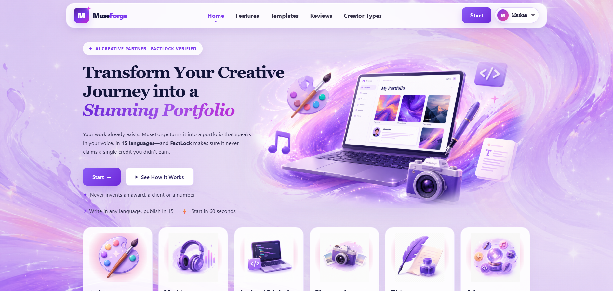
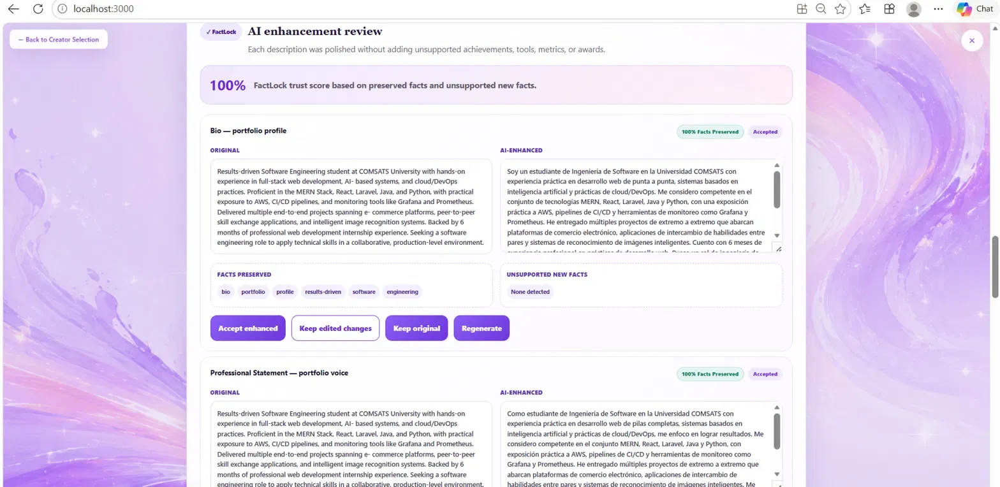
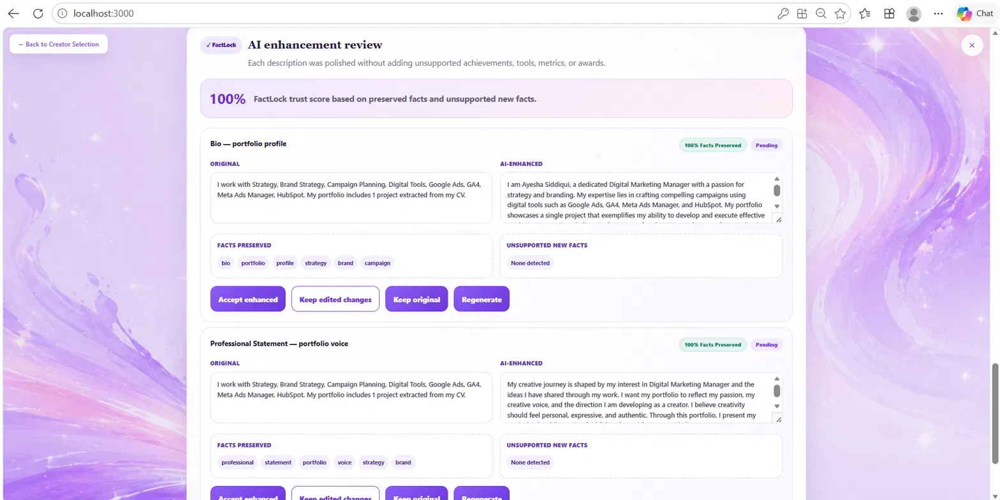
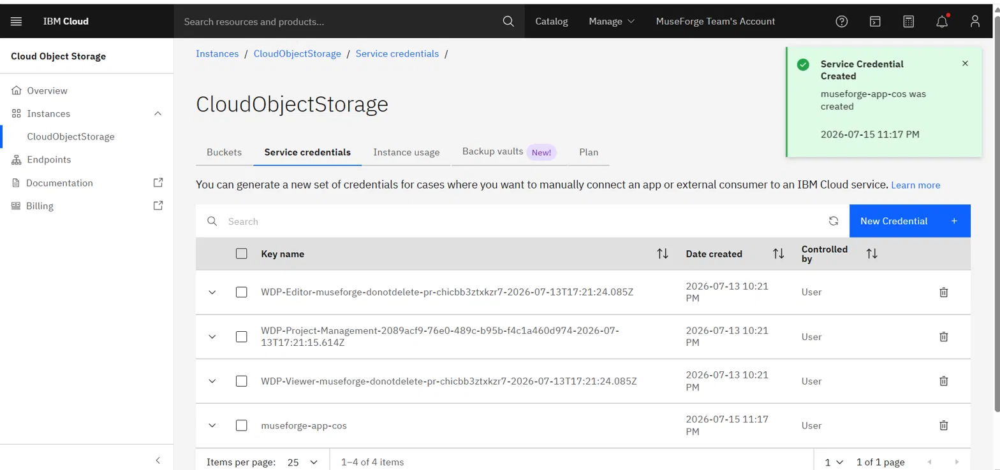
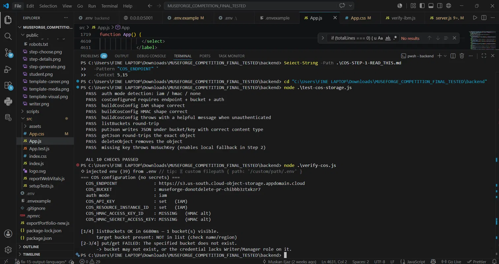
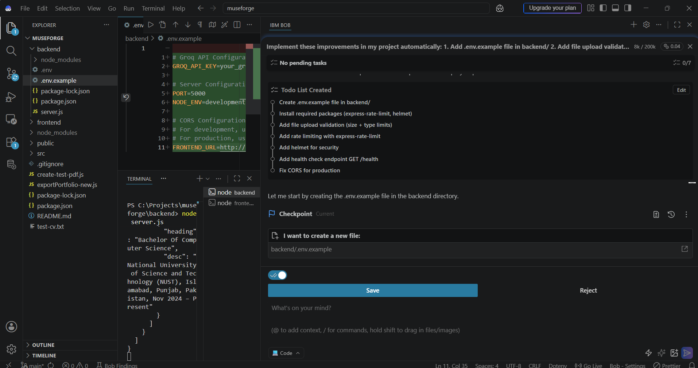
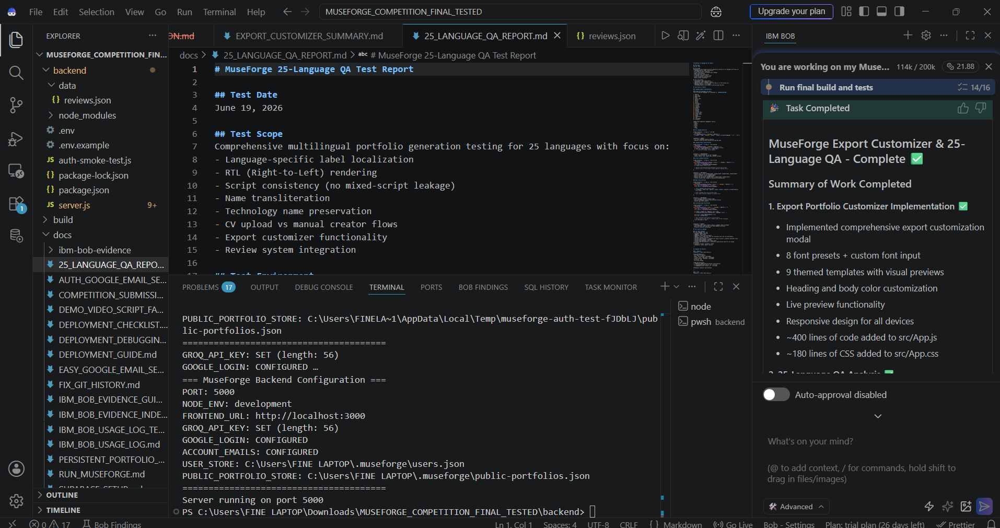
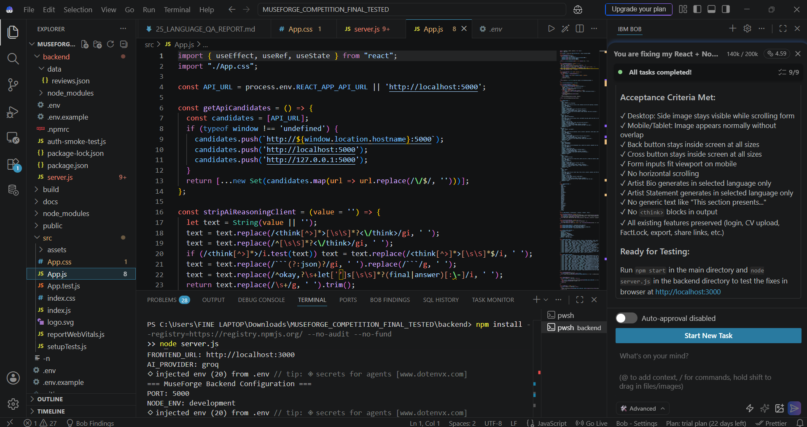

# MuseForge — AI Creative Identity Studio

<p align="center">
  
</p>

<p align="center">
  <a href="https://muse-forge.vercel.app/"></a>
  <a href="https://youtu.be/4JBoOCmW4Io"></a>
</p>

<p align="center">
  <a href="docs/IBM_BOB_EVIDENCE.md"></a>
  <a href="#1-the-ibm-stack-proves-itself"></a>
  <a href="#3-docling-verified-on-a-real-cv"></a>
  <a href="#2-ibm-cloud-object-storage-verified-end-to-end"></a>
  <a href="#the-ibm-stack-and-what-each-piece-actually-does"></a>
  <a href="backend/verify-langchain.js"></a>
</p>

<p align="center"><sub><i>Every badge links to the proof in this repository, not to a vendor page.</i></sub></p>

**MuseForge** turns what a creator has *actually made* — raw notes, project descriptions, CVs, images, audio, video — into a polished, shareable, multilingual portfolio that sounds like **them**, not like generic AI filler. It amplifies real work in the creator's own voice, and refuses to invent a single credit they didn't earn.

**Competition:** IBM AI Builders Challenge — July Challenge: *Reimagine Creative Industries with AI*
**Core innovation:** **FactLock** — the guardrail that keeps a creative identity *authentic*. It lets the generation pipeline **reject its own output** the moment the AI drifts into invented credits or generic slop, and backs that with a review panel showing the creator every surviving change. The creator's real work and real voice always win; nothing reaches the world until they approve it.

| | |
|---|---|
| 🚀 **Live app** | **https://muse-forge.vercel.app/** |
| 🎬 **Demo video** | **https://youtu.be/4JBoOCmW4Io** |
| 🩺 **Verify the IBM stack in one request** | `GET /ibm-status` — see [live output below](#1-the-ibm-stack-proves-itself) |
| 🧾 **IBM Bob evidence** | [`docs/IBM_BOB_EVIDENCE.md`](docs/IBM_BOB_EVIDENCE.md) — 17 organised screenshots |

---

## 🧭 Where to look for each judging criterion

| Criterion | Evidence in this repo |
|---|---|
| **Technical Execution** | [AI approach and architecture](#️-ai-approach-and-architecture) · [The IBM stack](#the-ibm-stack-and-what-each-piece-actually-does) · [`/ibm-status`](#1-the-ibm-stack-proves-itself) |
| **Innovation** | [FactLock](#1-factlock--a-generator-that-is-allowed-to-refuse-itself) — seven structural gates that reject the model's own output |
| **Challenge Fit** | [Selected challenge theme](#-selected-challenge-theme) |
| **Feasibility** | [Feasibility](#-feasibility) — deployed, degrades gracefully, small model, low cost per portfolio |
| **Real-World Impact** | [Real-world impact](#-real-world-impact) · [Known limitations](#️-known-limitations) |
| **Use of IBM Bob** | [How IBM Bob was used](#-how-ibm-bob-was-used) — 17 evidence screenshots across 10 areas |

---

## 🎯 Problem Statement

Creators have real work but struggle to present it. Their material is short, informal, multilingual, and scattered across CVs, project notes, images, video and audio.

They hit three walls:

1. **Writing about your own work is a genre nobody taught you.** Artist bios and statements are a specific literary form, and the blank page is where portfolios go to die.
2. **Generic AI tools invent things.** Ask any general model to "make my bio impressive" and it returns *award-winning*, *featured in major publications*, *5,000+ users*. For a creator, sending out a portfolio with a fabricated credit is not an embarrassment — it is a career risk. This is the single reason serious creators do not hand their identity to AI.
3. **The creative world is not English-only.** A creator in Lahore, Cairo, Seoul or São Paulo is expected to present in a language that is not their own, or not present at all.

**The gap is not generation. Generation is solved. The gap is trust.**

**The solution:** MuseForge adds **FactLock** — structural gates that reject unsafe AI output before the creator ever sees it, plus a review panel that makes every surviving change visible, reviewable and reversible.

---

## 🎨 Selected Challenge Theme

**Reimagine Creative Industries with AI.**

Creative industries run on the one thing generic AI actively erodes: an **authentic voice**. The moment a painter, musician or writer hands their identity to a general model, they get back *award-winning*, *critically acclaimed*, *featured in major publications* — hollow superlatives that make every creator sound like every other creator. AI slop is not a style; it is the absence of one.

MuseForge takes the opposite stance. It meets creators at the exact point where creative work becomes a creative *career* — the portfolio — and acts as a genuine creative **partner rather than a content generator**: it interviews, structures and phrases, in fifteen languages, while holding a line no general-purpose model holds. It will not invent a creator's credits, and it will not flatten their voice into filler. **FactLock** is how that promise is enforced in code rather than prompted and hoped for. In a category racing to generate *more*, MuseForge competes on keeping what it generates *true to the person* — and that, not raw generation, is the creative primitive the industry is missing.

---

## 💡 How It Works

1. **Create account** — email/password or Google sign-in with verification
2. **Choose creator path** — Artist, Musician, Student/Job Seeker, Photographer, Writer, or Other
3. **Input content** — fill details manually, or upload a CV (Student/Job Seeker path)
4. **Add work** — projects, custom sections, skills, images, video, audio
5. **Select language** — choose the output language from 15 supported languages
6. **Generate** — IBM Granite writes; FactLock gates every sentence
7. **Review FactLock** — original vs enhanced side by side → Accept / Keep Original / Manual Edit
8. **Export & share** — download standalone HTML, or publish a public portfolio URL

---

## 🌟 Key Features

### 1. FactLock — a generator that is allowed to refuse itself

MuseForge does not overwrite what the creator wrote. Every AI-written sentence passes structural gates **before it is ever displayed**. These are real code paths in `server.js`, not prompt wishes. The master gate is `regenerationIsStrongEnough()`, and it applies to **bios, statements and projects alike** — not just projects.

| Gate | What it rejects | Function |
|---|---|---|
| **Invented metric** | **Any number in the output that does not appear in the source.** "used by 5000 users", "won 3 awards", "10+ clients" — all rejected. Script-agnostic, so it guards every supported language equally | `candidateInventsUnsupportedClaims` → `numbersFromText` |
| **Invented credential** | A credential word present in the output but nowhere in the creator's own text — *award, winner, prize, client, revenue, funding, investor, published, viral, trending, ranked, featured, exhibited, bestselling, certified, patent, scholarship, grant, users, downloads, followers, subscribers, streams, views, million, thousand, billion*. Word-boundary matched, and the source includes the project title and medium, so a project genuinely called "Award Poster" is never falsely flagged | `candidateInventsUnsupportedClaims` → `UNSUPPORTED_CLAIM_TERMS` |
| **Dropped fact** | A number the creator *did* supply that the rewrite silently deleted | `candidateChangesOriginalFacts` |
| **Empty rewrite** | A same-length paraphrase dressed up as an improvement | `regenerationAddsValue` |
| **Prompt echo** | The model repeating the instructions back as portfolio content | `regenerationLooksPromptEcho` |
| **Voice break** | Third-person text in a portfolio that must speak as the creator | `regenerationUsesFirstPerson` |
| **Language break** | Wrong script, or English smuggled into a non-English portfolio — retried once, then rejected | `hasUnexpectedScriptForLanguage`, `looksLikeWrongEnglishForTarget` |

Length and sentence-count floors are applied per content type, with separate thresholds for compact scripts (Chinese, Japanese, Korean, Russian) so a valid CJK rewrite is never rejected for being "too short" in words.

Additional guards run on the translation path: `translationLooksFabricated` rejects leaked JSON, `[Your Name]` template placeholders, and output ballooning past 2.5× the source; `stripLeakedJsonAndEcho` cleans model scaffolding before anything is scored.

On any rejection MuseForge falls back **per item** to the creator's grounded original, still in the selected language. A failure never produces an English hole in a Japanese portfolio, and never produces a fabricated sentence.

**FactLock review panel.** For each item the creator sees the original description, the AI-enhanced description, the preserved user-provided facts, any unsupported new facts detected, and four choices: **Accept enhanced**, **Keep edited changes**, **Keep original**, **Regenerate**. Nothing is published until the creator approves every item — the final portfolio is generated only after all FactLock choices are locked.

<p align="center">
  
  <br /><sub><i>A CV written in English, published in Spanish. The original and the enhancement sit side by side, the preserved facts are listed, and the creator decides.</i></sub>
</p>

<p align="center">
  
  <br /><sub><i>Every item starts as <b>Pending</b>. The portfolio cannot be generated until each one has been accepted, edited or reverted.</i></sub>
</p>

**The AI proposes. The human ships.**

### 2. Multilingual Portfolio Generation

**Input is unrestricted.** Write or upload a CV in any language — the pipeline detects the source script and converts. A CV typed in Hindi still produces a Japanese portfolio. CV section headings are recognised through `CV_SECTION_ALIASES_MULTILINGUAL`, so a French or Chinese CV's headings are routed correctly rather than merged into the section above.

**Output is 15 languages:**

| Group | Languages |
|---|---|
| **European** | English · Spanish · French · German · Italian · Portuguese · Dutch · Polish · Turkish · Russian |
| **Asian** | Chinese · Japanese · Korean · Indonesian · Vietnamese |

Localisation goes **all the way down** — headings, section names, the creative field and item labels, not just body text. Structural text comes from **deterministic dictionaries**, so a portfolio is still fully in the selected language even if the model is briefly unreachable.

Skills are translated in a **single JSON round-trip** rather than one call per skill, with technology names (React, Node.js, Docker, MERN Stack, AWS) protected from translation. Any parse failure, length mismatch, wrong script or suspected fabrication falls back to the original skill — per item, not per batch.

### 3. CV Intelligence with IBM Docling

The Student/Job Seeker path supports PDF CV upload with:

- **IBM Docling** structure-aware extraction via `POST /v1/convert/file` (with `/v1alpha` fallback), running as `docling-serve` with RapidOCR models
- **Best-extraction selection** — Docling output is scored against a local parser and the stronger result wins (`parseBestCv`), with the decision logged: `CV parse: chose {"source":"docling","scores":{"docling":8,"local":8}}`
- **Multilingual fuzzy heading detection** — `SKILLS & TOOLS`, `KEY PROJECTS`, `WORK HISTORY`, headings split across two PDF lines, headings with trailing content on the same line, and non-English headings are all recognised
- **Embedded link routing** — verification links inside the PDF are matched to the item they actually belong to
- **Honest failure** — `cv-readability.js` classifies a document as unreadable for three concrete reasons: `empty` (no lines), `shattered-glyphs` (single-glyph ratio ≥ 0.35, typical of stylised or scanned scripts), and `collapsed-text-no-structure` (no structure, ≤ 2 lines, ≥ 20 dominant words). MuseForge then **tells the user** instead of quietly generating a hollow portfolio from noise

A tool that admits failure is worth more than one that always returns something.

### 4. Public Portfolio Links

After generation, creators publish a public portfolio URL:

```
/portfolio/fact-lock-artist-a1b2c3d4
```

- **Local development:** JSON storage with local fallback
- **Production:** Supabase-backed persistent storage
- **IBM Cloud Object Storage:** provisioned, credentialled and verified as the storage backend — see [IBM Cloud Object Storage](#2-ibm-cloud-object-storage-verified-end-to-end)
- **Setup guide:** [`docs/PERSISTENT_PORTFOLIO_LINKS_SETUP.md`](docs/PERSISTENT_PORTFOLIO_LINKS_SETUP.md)

### 5. Creator-Specific Workflows

Each creator type has its own fields, prompts, visuals and portfolio structure:

- **Artists** — visual project galleries with image uploads
- **Musicians** — audio and video integration for performances and compositions
- **Photographers** — image-focused portfolios with project descriptions
- **Writers** — text-heavy portfolios with publication details
- **Students / Job Seekers** — CV upload and parsing with career-focused templates
- **Other** — a general path for creators who don't fit a preset

### 6. Media Support

- **Images** — project galleries and profile pictures with smart repositioning
- **Video** — embedded video for creative work
- **Audio** — audio integration for musicians and podcasters

### 7. Export Customizer

- Select which sections to include
- Choose styling preferences
- Download as standalone HTML — **no lock-in**
- Copy generated text for use elsewhere

### 8. AI Project Suggestions

`POST /suggest-projects` proposes portfolio-ready project framings using the same IBM Granite dispatch and the same FactLock constraints, written in the creator's chosen language. On any failure it falls back to built-in suggestions, so the feature never dies mid-session.

### 9. Reviews and Ratings

Star ratings (1–5), written feedback, moderation, and public display on portfolio pages.

### 10. Authentication and Security

- Email/password authentication with verification codes, plus Google Sign-In
- Password reset flow and welcome emails
- **scrypt** password hashing, **HMAC-signed** session tokens
- **Helmet** security headers
- **Rate limiting**, with a stricter limiter on AI endpoints
- **PDF-only upload validation** with a 10 MB cap
- **CORS allowlist**, environment-based configuration

### What MuseForge deliberately does *not* do

- It does not write projects you didn't do, however much better the portfolio would read.
- It does not estimate metrics, dates, team sizes or audience numbers.
- It does not silently improve a fact it thinks is understated.
- It does not fall back to English when a translation is hard.
- It does not pretend to have read a document it could not read.

**Those refusals are the product.**

---

## 🏗️ AI Approach and Architecture

```
                    ┌──────────────────────────────────────────┐
   CV / document    │  IBM Docling  (docling-serve + RapidOCR) │
   ───────────────► │  POST /v1/convert/file                   │
                    │  headings · reading order · tables       │
                    └────────────────────┬─────────────────────┘
                                         │
                    ┌────────────────────▼─────────────────────┐
                    │  parseBestCv — Docling vs local parser,  │
                    │  scored, stronger extraction wins        │
                    │  cv-readability → honest failure on      │
                    │  empty / shattered-glyph / collapsed text│
                    └────────────────────┬─────────────────────┘
                                         │
                    ┌────────────────────▼─────────────────────┐
   Free text  ─────►│  Section + link resolver                 │
                    │  multilingual heading aliases            │
                    │  each embedded PDF link matched to the   │
                    │  item it actually belongs to             │
                    └────────────────────┬─────────────────────┘
                                         │  grounded facts
                    ┌────────────────────▼─────────────────────┐
                    │  IBM Granite on watsonx.ai               │
                    │  via LangChain ChatWatsonx               │
                    │  bio · statement · projects · skills     │
                    │  language-locked, fact-locked prompts    │
                    └────────────────────┬─────────────────────┘
                                         │  candidate text
        ┌────────────────────────────────▼───────────────────────────┐
        │  FactLock gate — regenerationIsStrongEnough()              │
        │   number not in the source?   → reject                     │
        │   credential not in source?   → reject                     │
        │   source number dropped?      → reject                     │
        │   nothing added over original?→ reject                     │
        │   prompt echoed back?         → reject                     │
        │   third person?               → reject                     │
        │   wrong script or language?   → retry once, then reject    │
        │  rejected → creator's grounded original, still in-language │
        └────────────────────────────────┬───────────────────────────┘
                                         │
                    ┌────────────────────▼─────────────────────┐
                    │  Deterministic localisation              │
                    │  section names · labels · field, from    │
                    │  dictionaries (15 languages) — correct   │
                    │  even when the model is unavailable      │
                    └────────────────────┬─────────────────────┘
                                         │
              Creator review: Accept / Keep Original / Manual Edit
                                         │
                    Portfolio · Trust Report · public share link
```

### The IBM stack, and what each piece actually does

| IBM technology | Where it runs | Why it, specifically |
|---|---|---|
| **IBM Bob** | Primary development tool across the entire build — [17 evidence screenshots](#-how-ibm-bob-was-used) | Required primary tool: code analysis, security hardening, feature implementation, multilingual QA, CV parsing debugging, deployment readiness, documentation |
| **IBM Granite on watsonx.ai** (`ibm/granite-3-8b-instruct`) | Bio, statement, project rewrites, skill translation, project suggestions, final translation sweep | Every prompt here is **constraint-following**, not free association: stay in this language, keep every fact, add nothing. Granite's instruction-following suits a system whose main job is to refuse to embellish — and an 8B instruct model keeps cost per portfolio low enough to be a real product |
| **IBM Docling** | `docling-serve` with RapidOCR on port 5001; `POST /v1/convert/file` → structured CV text | A CV is a layout problem before it is a language problem: two columns, tables, headings wrapped across lines, links attached to the wrong row. Docling recovers real document structure, which is what makes the downstream grounding trustworthy |
| **IBM Cloud Object Storage** | `cos-storage.js` on `ibm-cos-sdk`, IAM auth, bucket `museforge-donotdelete-pr-…`; verified with a live list/put/get/delete round-trip | Durable object storage for portfolio persistence, authenticated with the same IBM Cloud identity as watsonx — see [verification below](#2-ibm-cloud-object-storage-verified-end-to-end) |
| **LangChain `@langchain/ibm`** (`ChatWatsonx`) | Model orchestration path, `LANGCHAIN_ENABLED=true` / `AI_PROVIDER=langchain`; loaded via dynamic ESM import and cached | Standard orchestration without leaving the IBM path. If the package is absent it falls back to the direct watsonx call, so the pipeline never dies on a missing dependency |
| **IBM Cloud IAM** | Bearer tokens for watsonx and COS, minted from an IBM Cloud API key and cached until 60 seconds before expiry | One token per hour, not one per generation |

**Provider policy, stated plainly.** Granite on watsonx is the **primary and default model**: `selectAiProvider()` returns `watsonx` first whenever watsonx credentials are present. This deployment runs with `WATSONX_STRICT=true`, which means **no non-IBM model can be reached at all** — if Granite were unavailable, generation would fail rather than silently fall back. The live probe below reports `"strictIbmMode":true`.

---

## 🧪 Verification

Nothing in this README is asserted without something you can run.

### 1. The IBM stack proves itself

```bash
curl http://localhost:5000/ibm-status
```

Real response from this project:

```json
{
  "watsonxConfigured": true,
  "graniteModel": "ibm/granite-3-8b-instruct",
  "langchainInstalled": true,
  "doclingConfigured": true,
  "doclingReachable": false,
  "strictIbmMode": true
}
```

Booleans and public config only — never secrets. `doclingReachable` is a live probe, so it reports `false` when `docling-serve` is not currently running and `true` when it is. `strictIbmMode: true` is the important one: it means no non-IBM model can serve a request.

Covered by `test-ibm-status.js`.

### 2. IBM Cloud Object Storage, verified end to end

`test-cos-storage.js` — **ALL 10 CHECKS PASSED**:

```
PASS  auth mode detection: iam / hmac / none
PASS  cosConfigured requires endpoint + bucket + auth
PASS  buildCosConfig IAM shape correct
PASS  buildCosConfig HMAC shape correct
PASS  buildCosConfig throws with a helpful message when unauthenticated
PASS  listBuckets round-trip
PASS  putJson writes JSON under bucket/key with correct content type
PASS  getJson round-trips the exact object
PASS  deleteObject removes the object
PASS  missing key throws NoSuchKey (enables local fallback)
```

`verify-cos.js` — live round-trip against the real IBM Cloud bucket:

```
=== COS configuration (no secrets) ===
COS_ENDPOINT : https://s3.us-south.cloud-object-storage.appdomain.cloud
auth mode    : iam
[1/4] listBuckets  OK — target bucket present: yes
[2/4] putObject    OK — wrote museforge/_healthcheck/verify-….json
[3/4] getObject    OK — round-trip content matches: true
[4/4] deleteObject OK — cleaned up test object.
=== VERDICT: IBM COS is WORKING (auth + bucket + read/write round-trip). ===
```

The COS instance, bucket and `museforge-app-cos` service credential are provisioned in IBM Cloud under the MuseForge account:

<p align="center">
  
</p>

<p align="center">
  
</p>

The application data layer currently runs on Supabase with a local JSON fallback; migrating users, public portfolios and history onto the verified COS layer is the documented next step, and the storage module and its tests are already in the repo.

### 3. Docling, verified on a real CV

Server log from a live upload:

```
CV extraction: Docling succeeded {"endpoint":"/v1/convert/file","chars":3293}
CV extraction: {"doclingChars":2801,"localChars":2614,"embeddedLinks":0}
CV parse: chose {"source":"docling","scores":{"docling":8,"local":8}}
```

And the honest-failure path firing on a CV that could not be structured:

```
CV readability diagnostic: {"unreadable":true,"reason":"collapsed-text-no-structure",
  "singleGlyphRatio":0,"dominantScript":"latin","dominantWords":316,"structured":0,"totalLines":1}
```

Covered by `docling-cv-test.js`, `test-cv-readability.js`, and the diagnostic probes `probe-cv.js`, `probe-ocr.js`, `probe-sections.js`.

### 4. FactLock and language suites

```bash
node factlock-test.js          # the fabrication gates
node adversarial-test.js       # deliberately hostile model behaviour
node language-e2e-test.js      # generations across the supported languages
node regenerate-e2e-test.js    # regenerations, including fabrication attempts
node lang-test.js              # per-language output validation
node lang-headings-test.js     # headings and section names, not just body text
node first-person-test.js      # every section speaks as the creator
node multilang-cv-test.js      # CVs written in many languages, parsed
node cv-test-harness.js        # CV section recall at scale
node links-test.js             # embedded PDF link routing
node test-suggest-projects.js  # AI project suggestions route
node auth-smoke-test.js        # auth flow
```

The end-to-end suites drive the real endpoints against a **deliberately hostile mock model** that answers in the wrong language, answers in the wrong script, throws 429s, echoes the prompt back, and tries to smuggle in fabricated metrics. They measure **the guard rails**, not live Granite quality. The mock and its failure-injection rate are in the repo — change them and re-run.

### 5. Live IBM verification with your own credentials

```bash
node verify-ibm.js        # IAM token, Granite availability, live Granite reply, Docling
node verify-langchain.js  # the @langchain/ibm ChatWatsonx path against watsonx
node verify-languages.js  # a Granite-written bio in each supported language, scored
node verify-cos.js        # live COS auth + bucket + read/write round-trip
```

### 6. Application suites

```powershell
npm run test:ci -- --runInBand   # frontend
npm --prefix backend test        # backend
npm run build                    # production build
```

---

## 🧰 Technology Stack

### AI, document intelligence and cloud (IBM)
- **IBM Granite on watsonx.ai** — primary generation model (`ibm/granite-3-8b-instruct`)
- **IBM Docling** — structure-aware CV and PDF extraction (`docling-serve` + RapidOCR)
- **IBM Cloud Object Storage** — `ibm-cos-sdk`, IAM-authenticated object storage
- **IBM Cloud IAM** — token minting and caching for watsonx and COS
- **LangChain `@langchain/ibm`** — `ChatWatsonx` orchestration path
- **IBM Bob** — primary development tool

### Frontend
- **React** — component-based UI (`src/App.js`)
- **CSS** — custom styling and responsive design
- **Google Identity Services** — OAuth integration
- **Path-based routing** — portfolio preview and public links

### Backend
- **Node.js** + **Express** — runtime and web framework (`backend/server.js`)
- **Multer** — file upload handling
- **pdf-parse** / **pdfreader** / **pdfjs-dist** — local PDF fallback parsing and embedded link extraction
- **Nodemailer** — email notifications
- **google-auth-library** — token verification
- **Groq / OpenAI / Gemini SDKs** — availability fallbacks, disabled entirely under `WATSONX_STRICT=true`
- **Supabase** — production persistent storage, with local JSON fallback

### Security
- **Helmet** — security headers
- **express-rate-limit** — API protection, stricter on AI endpoints
- **Input validation** — XSS prevention
- **File validation** — PDF-only, 10 MB cap
- **Environment variables** — credential management

---

## 📁 Project Structure

```
MUSEFORGE_COMPETITION_FINAL_TESTED/
├── backend/
│   ├── server.js                   # Express server: watsonx/Granite, Docling, FactLock, all routes
│   ├── cv-readability.js           # Honest-failure classifier for unreadable documents
│   ├── cos-storage.js              # IBM Cloud Object Storage layer (ibm-cos-sdk, IAM)
│   ├── ibm-status.js               # Read-only IBM stack probe (GET /ibm-status)
│   ├── project-suggestions.js      # AI project suggestions via the Granite dispatch
│   ├── data/                       # Local JSON store
│   │
│   ├── verify-ibm.js               # IAM + Granite + Docling live check
│   ├── verify-langchain.js         # ChatWatsonx path check
│   ├── verify-languages.js         # Granite bio per language, scored
│   ├── verify-cos.js               # Live COS round-trip
│   │
│   ├── factlock-test.js            # FactLock fabrication gates
│   ├── adversarial-test.js         # Hostile-model behaviour
│   ├── language-e2e-test.js        # End-to-end language guarantee
│   ├── regenerate-e2e-test.js      # End-to-end regeneration guarantee
│   ├── lang-test.js                # Per-language output validation
│   ├── lang-headings-test.js       # Headings and section names
│   ├── first-person-test.js        # Creator voice across languages
│   ├── multilang-cv-test.js        # CVs written in many languages
│   ├── cv-test-harness.js          # CV section recall at scale
│   ├── docling-cv-test.js          # Docling extraction
│   ├── test-cv-readability.js      # Unreadable-document classifier
│   ├── links-test.js               # Embedded PDF link routing
│   ├── test-cos-storage.js         # COS storage layer (10 checks)
│   ├── test-ibm-status.js          # /ibm-status probe
│   ├── test-suggest-projects.js    # Project suggestions route
│   ├── auth-smoke-test.js          # Auth flow
│   ├── probe-cv.js / probe-ocr.js / probe-sections.js   # Diagnostics
│   ├── .env.example
│   └── package.json
├── docs/
│   ├── IBM_BOB_EVIDENCE.md         # Full IBM Bob usage documentation
│   ├── IBM_BOB_EVIDENCE_INDEX.md   # Screenshot inventory
│   ├── IBM_BOB_EVIDENCE_GUIDE.md
│   ├── IBM_BOB_USAGE_LOG.md
│   ├── ibm-bob-evidence/           # 17 organised evidence screenshots
│   ├── readme-assets/              # README imagery
│   ├── COMPETITION_SUBMISSION_CHECKLIST.md
│   ├── DEMO_VIDEO_SCRIPT_FACTLOCK_FIRST.md
│   ├── DEPLOYMENT_CHECKLIST.md
│   ├── DEPLOYMENT_GUIDE.md
│   ├── LANGUAGE_QA_STATUS.md
│   ├── PERSISTENT_PORTFOLIO_LINKS_SETUP.md
│   ├── SUPABASE_SETUP.md
│   ├── supabase-production-schema.sql
│   ├── TEST_EXECUTION_SUMMARY.md
│   └── TEST_RESULTS.md
├── src/
│   ├── App.js                      # Main React application
│   ├── App.css                     # Application styling
│   ├── App.test.js
│   ├── index.js / index.css
│   └── assets/
├── public/
├── .env.example
├── package.json
└── README.md
```

---

## 🚀 Installation and Setup

### Prerequisites
- Node.js v18 or higher
- npm
- **IBM Cloud account** with a watsonx.ai project (API key + project ID)
- Python environment or Docker for Docling — optional but recommended
- Google OAuth credentials — optional
- Gmail app password — optional, for email

### 1. Install dependencies

```powershell
npm install --ignore-scripts
npm --prefix backend install
```

### 2. Configure environment variables

```powershell
Copy-Item .env.example .env
Copy-Item backend\.env.example backend\.env
```

**Root `.env`**
```env
REACT_APP_API_URL=http://localhost:5000
REACT_APP_GOOGLE_CLIENT_ID=your_google_client_id
```

**Backend `.env`**
```env
# --- IBM watsonx.ai / Granite (primary AI provider) ---
WATSONX_API_KEY=your_ibm_cloud_api_key
WATSONX_PROJECT_ID=your_watsonx_project_id
WATSONX_URL=https://us-south.ml.cloud.ibm.com
WATSONX_MODEL=ibm/granite-3-8b-instruct
WATSONX_STRICT=true           # no non-IBM model can be reached
AI_PROVIDER=watsonx
LANGCHAIN_ENABLED=true        # route through @langchain/ibm ChatWatsonx

# --- IBM Docling (document intelligence) ---
DOCLING_URL=http://localhost:5001
DOCLING_OCR=false
DOCLING_TIMEOUT_MS=20000

# --- IBM Cloud Object Storage ---
COS_ENDPOINT=https://s3.us-south.cloud-object-storage.appdomain.cloud
COS_BUCKET=your_bucket_name
COS_API_KEY=your_cos_api_key
COS_RESOURCE_INSTANCE_ID=your_cos_instance_id

# --- Authentication ---
AUTH_SECRET=your_long_random_secret_min_32_chars
GOOGLE_CLIENT_ID=your_google_client_id

# --- Email (optional) ---
SMTP_SERVICE=gmail
SMTP_USER=your_sender_gmail@gmail.com
SMTP_PASS=your_16_character_gmail_app_password
MAIL_FROM="MuseForge <your_sender_gmail@gmail.com>"

# --- Server ---
PORT=5000
NODE_ENV=development
FRONTEND_URL=http://localhost:3000

# --- Supabase (production persistence) ---
SUPABASE_URL=https://your-project-ref.supabase.co
SUPABASE_SERVICE_ROLE_KEY=your_supabase_service_role_key
SUPABASE_PORTFOLIOS_TABLE=public_portfolios
SUPABASE_REVIEWS_TABLE=public_reviews
```

> ⚠️ Never commit real `.env` files to version control.

### 3. Start Docling (optional but recommended)

```powershell
cd backend
.\.docling-venv\Scripts\Activate.ps1
docling-serve run --enable-ui
```

Docling serves on `http://0.0.0.0:5001`. Without it, MuseForge falls back to local PDF parsing — uploads still work, but document understanding is weaker.

### 4. Run the app

```powershell
npm run dev
```

Or in separate terminals:

```powershell
# Terminal 1
cd backend
node server.js

# Terminal 2
npm start
```

**Access**
- Frontend — `http://localhost:3000`
- IBM stack status — `http://localhost:5000/ibm-status`

### API surface

`POST /parse-cv` · `POST /generate` · `POST /factlock/regenerate` · `POST /suggest-projects` · `POST /portfolio/share` · `GET /portfolio/:id` · `GET /ibm-status` · `GET|POST /user-history` · auth routes under `/auth/*`

---

## 🤖 How IBM Bob Was Used

IBM Bob was the **primary development tool** for MuseForge, used across ten distinct areas of the build. Every claim below is backed by a screenshot in [`docs/ibm-bob-evidence/`](docs/ibm-bob-evidence/).

### Code analysis and debugging
Bob performed HTML syntax analysis to identify structural and semantic markup issues, then applied targeted fixes that improved maintainability, accessibility and browser compatibility.
`01-bob-html-syntax-review.png` · `02-bob-html-fixes-applied.png`

### Security hardening
Bob guided secure environment configuration — `.env` structure, API key management, environment-variable practice — and then implemented the backend security layer: Helmet headers, rate limiting, input validation, CORS configuration and file-upload security.

<p align="center">
  
</p>

`03-bob-env-setup.png` · `04-bob-security-hardening.png`

### CV parsing and document processing
Bob debugged the CV parsing pipeline — PDF text extraction, data-field mapping, and error handling across varied CV formats — the layer that feeds every downstream grounding decision.

<p align="center">
  
</p>

`11-bob-cv-parsing-fix.png`

### Multilingual QA and language fixes
Bob ran quality-assurance passes across the supported language set and implemented fixes for text overflow, script rendering, character encoding and translation accuracy.

<p align="center">
  
</p>

`09-bob-language-qa.png` · `12-bob-multilingual-fix.png`

### Feature implementation
Bob contributed to the reviews and ratings feature from strategic planning through to API endpoint architecture, data validation and frontend integration; configured persistent public portfolio link storage; and implemented the portfolio export customiser.
`06-bob-reviews-feature.png` · `07-bob-supabase-public-links.png` · `14-bob-reviews-planning.png` · `16-bob-export-customizer.png`

### React UI and responsive design
Bob identified and resolved React rendering issues, responsive layout problems and component bugs for consistent cross-device behaviour.
`10-bob-react-responsive-fixes.png`

### Testing and acceptance
Bob ran end-to-end validation across features, user flows and edge cases, then verified the build against the competition's acceptance criteria.
`08-bob-final-testing.png` · `13-bob-acceptance-criteria.png`

### Deployment readiness
Bob produced and validated a deployment checklist covering environment variables, build optimisation, security headers, storage configuration and production readiness.
`05-bob-deployment-checklist.png`

### Documentation
Bob assisted in producing the project documentation set — setup instructions, feature descriptions, usage guidelines and technical guides.
`15-bob-readme-documentation.png`

### Project setup
`17-bob-ui-welcome.png` captures the first Bob session on MuseForge, where the project scope and working approach were established.

**Evidence index**

| Area | Screenshots |
|---|---|
| Code analysis and debugging | 2 |
| Security hardening | 2 |
| Deployment readiness | 1 |
| Reviews and ratings feature | 3 |
| Multilingual QA and language fixes | 2 |
| CV parsing and portfolio generation | 1 |
| React UI and responsive fixes | 1 |
| Final testing and acceptance | 2 |
| Documentation | 1 |
| Additional features | 2 |
| **Total** | **17** |

Full write-up: [`docs/IBM_BOB_EVIDENCE.md`](docs/IBM_BOB_EVIDENCE.md) · Inventory: [`docs/IBM_BOB_EVIDENCE_INDEX.md`](docs/IBM_BOB_EVIDENCE_INDEX.md) · Session log: [`docs/IBM_BOB_USAGE_LOG.md`](docs/IBM_BOB_USAGE_LOG.md)

---

## 📊 Competition Readiness

| Requirement | Status | Evidence |
|---|---|---|
| Working prototype built with IBM Bob | ✅ Complete | 17 evidence screenshots in `docs/ibm-bob-evidence/` |
| AI as a core functional component | ✅ Complete | IBM Granite on watsonx.ai drives generation; FactLock gates it |
| IBM technologies used | ✅ Complete | Granite / watsonx.ai · Docling · Cloud Object Storage · Cloud IAM · LangChain `@langchain/ibm` · IBM Bob |
| Public GitHub repository | ✅ Complete | Clean codebase with proper `.gitignore` |
| README with problem, solution, AI approach, theme, Bob usage | ✅ Complete | This document |
| Live deployment | ✅ Complete | https://muse-forge.vercel.app/ |
| Demo video (≤ 3 minutes) | 🎬 Link coming soon | Script in `docs/DEMO_VIDEO_SCRIPT_FACTLOCK_FIRST.md` |
| Security implementation | ✅ Complete | Helmet · tiered rate limiting · input validation · upload security · CORS allowlist |
| Testing coverage | ✅ Complete | 20+ suites: FactLock, adversarial, language, CV parsing, Docling, COS, IBM status, auth |

### 🎯 Competitive advantages

1. **FactLock is enforcement, not a prompt.** Seven structural gates in code that reject the model's own output — including a script-agnostic invented-number guard and a 40-term credential guard. Most "anti-hallucination" projects ship an instruction and hope.
2. **The IBM stack is verifiable, not decorative.** `GET /ibm-status` proves it in one request, `WATSONX_STRICT=true` proves the model, and `verify-cos.js` proves the storage with a live read/write round-trip.
3. **A generative product that admits failure.** Unreadable CV → say so, with a named reason. Model unreachable → deterministic localised draft in the correct language. Rate limited → cooldown and fallback, never a crash.
4. **Multilingual all the way down** — headings, labels and creative field, not just body text, with dictionary fallbacks that survive model outages and multilingual CV heading detection on the way in.
5. **Six creator-specific workflows** rather than one generic form.
6. **Security-conscious by default** — Helmet, tiered rate limiting, upload validation, CORS allowlist, scrypt hashing, HMAC-signed sessions.
7. **Extensively documented IBM Bob integration** — 17 evidence screenshots across 10 areas of the build.

---

## 🎬 Demo Strategy

Why → How → Demo → Impact, one clean creative flow — **pre-recorded and edited, never live against a running API.**

1. **Hook** (10s) — a creator's real work in; a polished portfolio in their own language out; no invented credits.
2. **The problem, for creators** (30s) — brilliant work, no bio, no English, no budget for a translator or designer — and generic AI that would paper over it with fabricated superlatives.
3. **Hero demo** (75s) — real creative input → generated portfolio → the same portfolio re-rendered live from one language into another. This is the show.
4. **The authenticity beat** (25s) — a generic prompt inventing a fake award, then MuseForge omitting it: FactLock protecting the creator's real voice, on camera.
5. **Impact + future** (20s) — one concrete creator who can now present globally, in their own language, with nothing fabricated.

**Full script:** [`docs/DEMO_VIDEO_SCRIPT_FACTLOCK_FIRST.md`](docs/DEMO_VIDEO_SCRIPT_FACTLOCK_FIRST.md)

---

## 🧱 Feasibility

- **Already deployed**, not a notebook: React frontend on Vercel, Node/Express backend, running against live watsonx.
- **Degrades instead of dying.** No Docling → local PDF parsing. Model unreachable → deterministic localised draft, still in the right language. Rate limited → cooldown and fallback. LangChain package missing → direct watsonx call. COS key missing → local fallback.
- **Cheap per portfolio.** An 8B instruct model over a handful of short, constrained prompts — not a frontier model rewriting an entire document. This is what makes it viable for creators who cannot pay much.
- **No lock-in.** Portfolios export as standalone HTML and publish as a public share link.
- **Production hygiene already in place** — Helmet, tiered rate limiting, upload validation, CORS allowlist, scrypt hashing, HMAC-signed sessions.

---

## 🌍 Real-World Impact

- **Who it is for:** working creators who have real output and no presentable identity — the illustrator with forty finished pieces and no site, the musician with recordings and no press page, the writer with a body of work and no bio. New graduates with real projects and an unread CV are served by the same engine through the Student / Job Seeker path.
- **Why the authenticity guarantee matters:** a fabricated credit can end a commission, a grant or a job offer — and generic AI filler quietly signals that a creator didn't care enough to sound like themselves. Voice and trust are precisely why the people whose reputation *is* their product have not adopted AI portfolio tools. FactLock is built for exactly them.
- **Why multilingual matters:** presenting in your own language is not a localisation nicety for a creator in Lahore or São Paulo. It is the difference between reaching a global audience and staying invisible.

---

## 📝 Documentation

- **[IBM_BOB_EVIDENCE.md](docs/IBM_BOB_EVIDENCE.md)** — complete IBM Bob usage documentation
- **[IBM_BOB_EVIDENCE_INDEX.md](docs/IBM_BOB_EVIDENCE_INDEX.md)** — screenshot inventory
- **[IBM_BOB_USAGE_LOG.md](docs/IBM_BOB_USAGE_LOG.md)** — session log
- **[COMPETITION_SUBMISSION_CHECKLIST.md](docs/COMPETITION_SUBMISSION_CHECKLIST.md)** — submission tracking
- **[DEMO_VIDEO_SCRIPT_FACTLOCK_FIRST.md](docs/DEMO_VIDEO_SCRIPT_FACTLOCK_FIRST.md)** — demo script
- **[DEPLOYMENT_CHECKLIST.md](docs/DEPLOYMENT_CHECKLIST.md)** · **[DEPLOYMENT_GUIDE.md](docs/DEPLOYMENT_GUIDE.md)** — production readiness
- **[LANGUAGE_QA_STATUS.md](docs/LANGUAGE_QA_STATUS.md)** — multilingual QA status
- **[PERSISTENT_PORTFOLIO_LINKS_SETUP.md](docs/PERSISTENT_PORTFOLIO_LINKS_SETUP.md)** — public link storage
- **[SUPABASE_SETUP.md](docs/SUPABASE_SETUP.md)** — database configuration
- **[TEST_EXECUTION_SUMMARY.md](docs/TEST_EXECUTION_SUMMARY.md)** · **[TEST_RESULTS.md](docs/TEST_RESULTS.md)** — test records

---

## ⚠️ Known Limitations

- **Fabrication defence is structural, not semantic.** The gates catch invented numbers, invented credentials, dropped facts, empty paraphrase, prompt echo, wrong voice and wrong language. A fluent, plausible invention that uses no numbers and no credential words can still reach the review step — which is exactly why the creator must approve every item before publication. The human review is not a UX flourish; it is the last gate.
- **The anchor and domain comparison is strongest for Latin-script output.** For Chinese, Japanese, Korean and Russian output the number guard and the prompt constraints carry that load. Extending anchor comparison to every script is a known next step.
- **Data layer migration to COS is pending.** IBM Cloud Object Storage is provisioned, credentialled and verified with a passing round-trip, and `cos-storage.js` is in the repo; users, public portfolios and history currently run on Supabase with a local JSON fallback.
- **Embedded PDF link extraction can fail on some documents** when the `pdfjs-dist` API and worker versions disagree; extraction falls back cleanly and the CV still parses.
- **Docling is optional.** Without it, document understanding is weaker.
- **Scanned or heavily stylised PDFs depend on OCR** (`DOCLING_OCR=true`). Some still extract as broken glyphs, in which case MuseForge reports `shattered-glyphs` and tells the user plainly rather than generating a portfolio from noise.
- **Email features require SMTP configuration** and are optional for core functionality.
- **User testing evidence is still being collected.** No invented adoption metrics appear anywhere in this README.

---

## 🚀 Future Improvements

### Technical
- Migrate the users / portfolios / history data layer onto the verified IBM COS storage module
- Surface a live FactLock rejection count in the Trust Report
- Extend anchor and domain comparison to non-Latin scripts
- Pin `pdfjs-dist` API and worker versions to restore embedded link extraction on all PDFs
- Custom username slugs for portfolio URLs
- Portfolio analytics dashboard

### Features
- More portfolio template styles
- Advanced export formats (PDF, DOCX)
- Portfolio version history
- Team collaboration mode

### UX
- Better multilingual typography
- Enhanced right-to-left layout support
- Mobile app version
- Offline portfolio editing

---

## 📄 License

Developed for the IBM AI Builders Challenge — July Challenge: *Reimagine Creative Industries with AI*.

---

## 🙏 Acknowledgments

- **IBM AI Builders Challenge** — for the opportunity to reimagine creative industries with AI
- **IBM Bob** — primary development tool throughout the project
- **IBM watsonx.ai and Granite** — the generation model behind every portfolio
- **IBM Docling** — document intelligence for CV understanding
- **IBM Cloud** — Object Storage and IAM authentication
- **LangChain** — for the `@langchain/ibm` integration
- **Supabase** — persistent storage infrastructure

---

<p align="center">
  <strong>Live app:</strong> <a href="https://muse-forge.vercel.app/">muse-forge.vercel.app</a> ·
  <strong>IBM Bob evidence:</strong> <a href="docs/IBM_BOB_EVIDENCE.md">docs/IBM_BOB_EVIDENCE.md</a>
</p>
