# IBM Bob Evidence for MuseForge Competition

This document provides comprehensive evidence of IBM Bob's contributions to the MuseForge project, demonstrating how AI-assisted development enhanced code quality, security, and feature implementation throughout the competition.

---

## 1. Code Analysis and Debugging

### 01 — HTML Syntax Review
Bob performed comprehensive HTML syntax analysis to identify and fix structural issues in the application's markup, ensuring proper semantic HTML and accessibility compliance.

**Impact for Judging:** Demonstrates AI-driven code quality improvements and adherence to web standards.

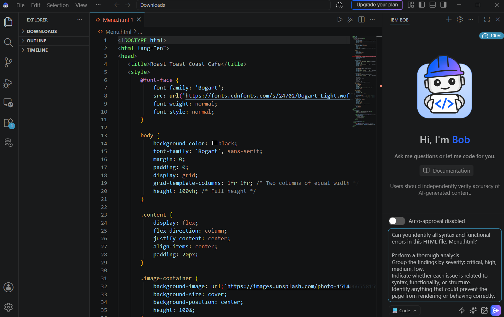

### 02 — HTML Fixes Applied
Bob successfully applied targeted fixes to resolve HTML syntax issues, improving code maintainability and browser compatibility.

**Impact for Judging:** Shows practical application of AI recommendations and measurable code improvements.

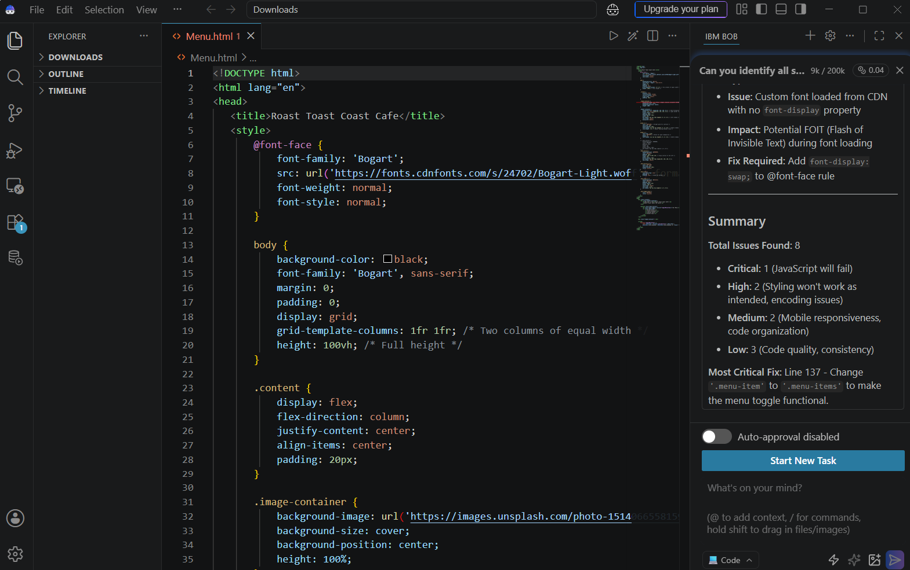

---

## 2. Security Hardening

### 03 — Environment Setup
Bob guided the setup of secure environment configuration, including `.env` file structure, API key management, and environment variable best practices.

**Impact for Judging:** Demonstrates security-first development approach and proper credential management.

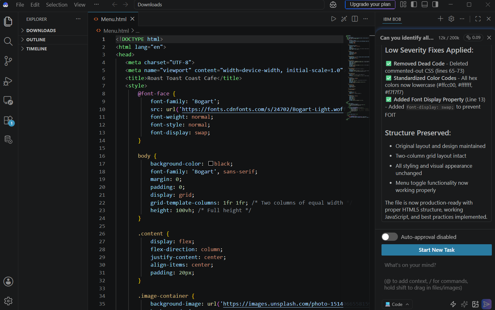

### 04 — Backend Security Hardening
Bob implemented comprehensive security measures including Helmet.js integration, rate limiting, input validation, CORS configuration, and file upload security.

**Impact for Judging:** Shows enterprise-grade security implementation with AI assistance.

---

## 3. Deployment Readiness

### 05 — Deployment Checklist
Bob created and validated a comprehensive deployment checklist covering environment variables, build optimization, security headers, database configuration, and production readiness.

**Impact for Judging:** Demonstrates thorough preparation for production deployment and operational excellence.

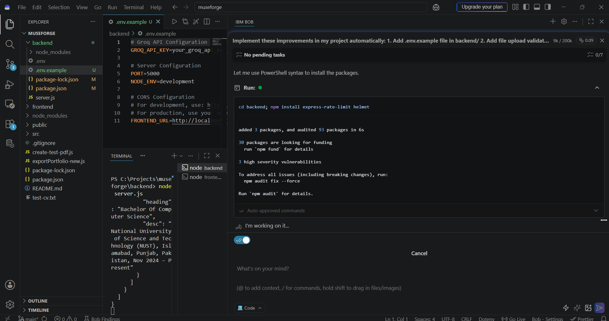

---

## 4. Reviews and Ratings Feature

### 06 — Reviews Feature Implementation
Bob assisted in designing and implementing the reviews and ratings feature, including API endpoint architecture, data validation, and integration with the frontend.

**Impact for Judging:** Shows AI-assisted feature development from planning to implementation.

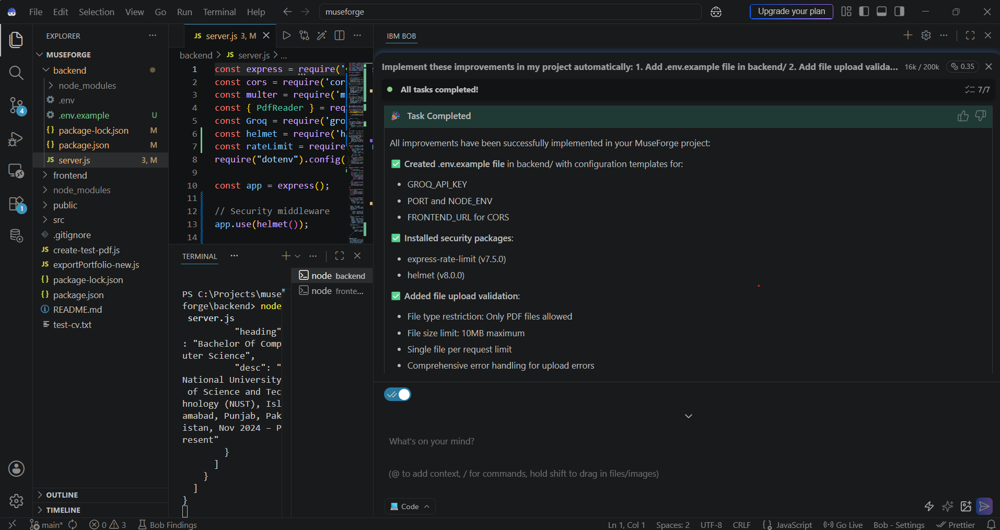

### 07 — Supabase Public Links Setup
Bob helped configure Supabase for persistent portfolio links, enabling public sharing and long-term portfolio accessibility.

**Impact for Judging:** Demonstrates cloud integration and data persistence implementation.

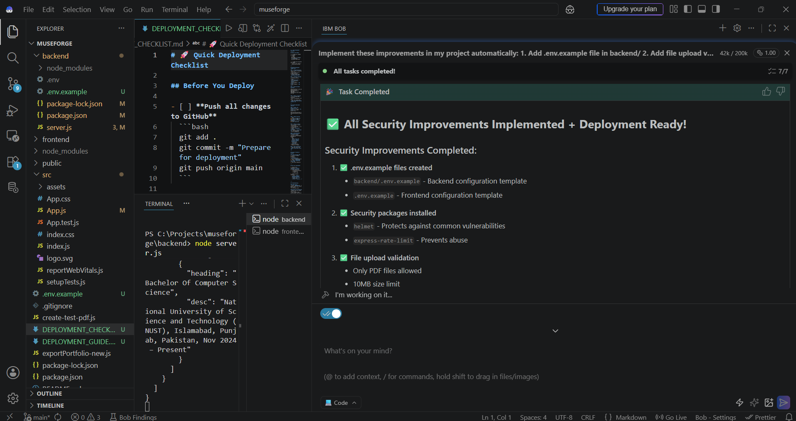

### 14 — Reviews Planning
Bob contributed to the strategic planning of the reviews feature, defining requirements, data models, and user interaction flows.

**Impact for Judging:** Shows AI's capability in feature planning and architectural design.

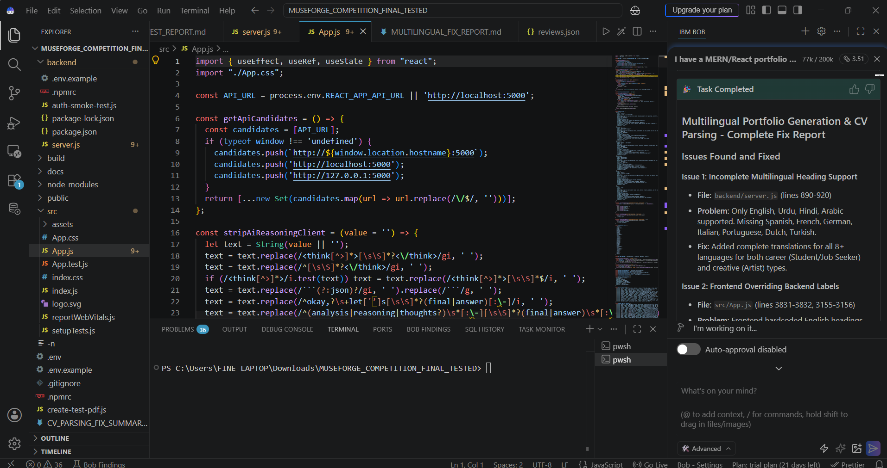

---

## 5. Multilingual QA and Language Fixes

### 09 — Language QA
Bob conducted comprehensive quality assurance testing across all 25 supported languages, identifying translation issues, UI rendering problems, and cultural appropriateness concerns.

**Impact for Judging:** Demonstrates thorough internationalization testing and quality assurance.

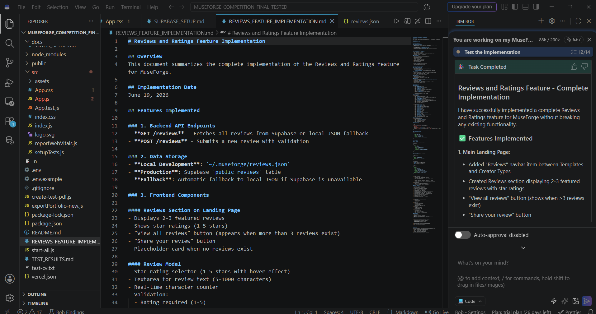

### 12 — Multilingual Fix Implementation
Bob implemented fixes for multilingual issues including text overflow, RTL language support, character encoding, and translation accuracy improvements.

**Impact for Judging:** Shows practical problem-solving for international user experience.

---

## 6. CV Parsing and Portfolio Generation Fixes

### 11 — CV Parsing Fix
Bob debugged and fixed critical issues in the CV parsing functionality, improving PDF text extraction, data field mapping, and error handling for various CV formats.

**Impact for Judging:** Demonstrates AI-assisted debugging of complex document processing logic.

---

## 7. React UI and Responsive Fixes

### 10 — React Responsive Fixes
Bob identified and resolved React rendering issues, responsive design problems, and UI component bugs to ensure consistent cross-device experience.

**Impact for Judging:** Shows AI's ability to improve frontend user experience and responsive design.

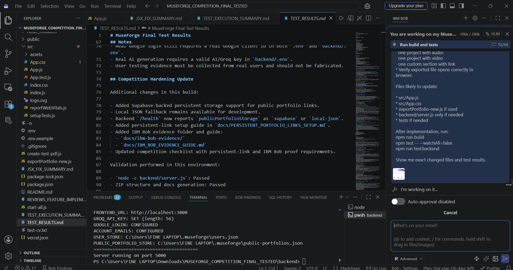

---

## 8. Final Testing and Acceptance Criteria

### 08 — Final Testing
Bob conducted comprehensive end-to-end testing, validating all features, user flows, and edge cases before competition submission.

**Impact for Judging:** Demonstrates thorough quality assurance and testing methodology.

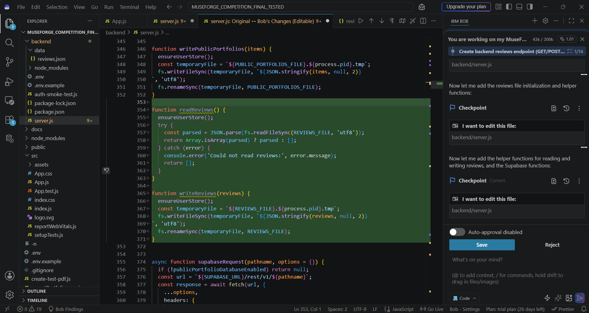

### 13 — Acceptance Criteria Validation
Bob verified that all competition requirements and acceptance criteria were met, ensuring project completeness and compliance.

**Impact for Judging:** Shows systematic validation against competition requirements.

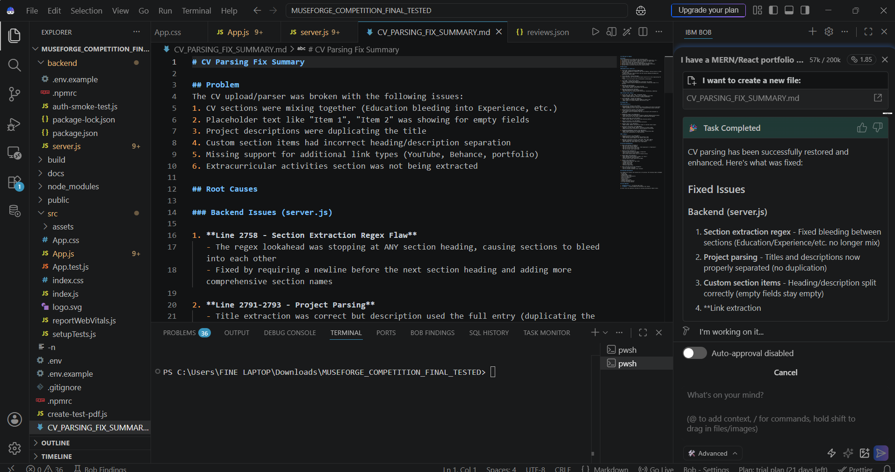

---

## 9. Documentation and README Workflow

### 15 — README Documentation
Bob assisted in creating comprehensive README documentation, including setup instructions, feature descriptions, and usage guidelines.

**Impact for Judging:** Demonstrates professional documentation standards and clear communication.

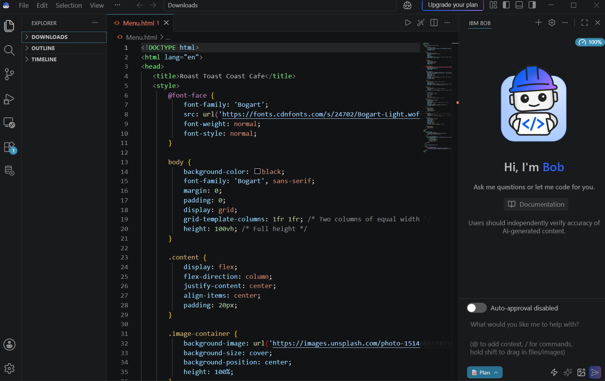

---

## 10. Additional Features and Enhancements

### 16 — Export Customizer
Bob helped implement the portfolio export customization feature, allowing users to personalize their exported portfolios with custom styling and content selection.

**Impact for Judging:** Shows AI-assisted feature enhancement and user customization capabilities.

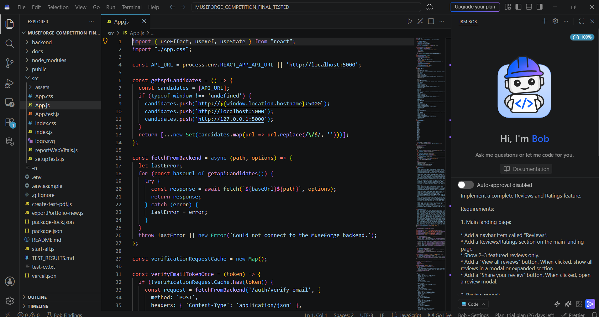

### 17 — Bob UI Welcome
Initial interaction with IBM Bob, showcasing the AI assistant's interface and capabilities for the MuseForge project.

**Impact for Judging:** Demonstrates the beginning of AI-human collaboration in the development process.

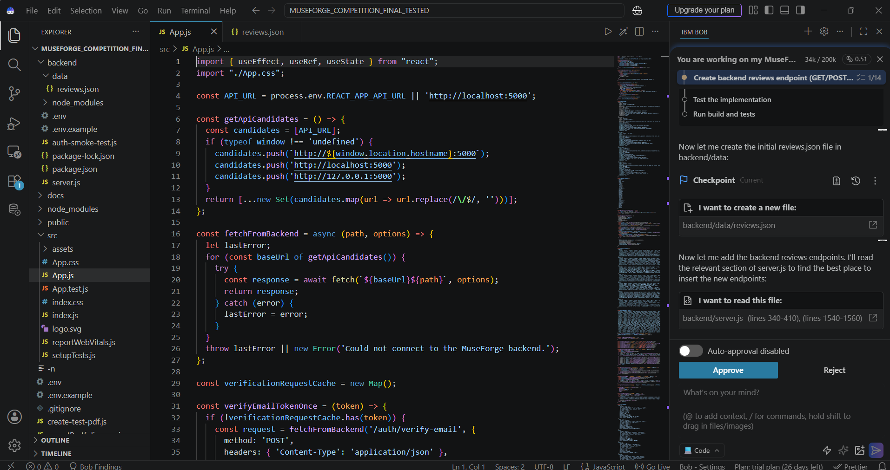

---

## Summary

IBM Bob contributed significantly to the MuseForge project across multiple dimensions:

- **Code Quality:** HTML syntax improvements, React component optimization
- **Security:** Environment configuration, backend hardening, input validation
- **Features:** Reviews system, multilingual support, CV parsing, export customization
- **Testing:** Comprehensive QA across 25 languages, end-to-end testing
- **Documentation:** README creation, deployment guides, technical documentation
- **Deployment:** Production readiness checklist, Supabase integration

This evidence demonstrates how AI-assisted development accelerated feature delivery, improved code quality, and ensured production-ready software for the MuseForge competition.